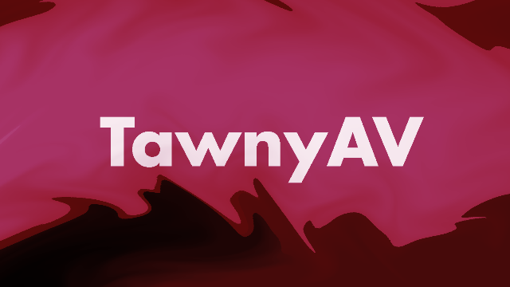
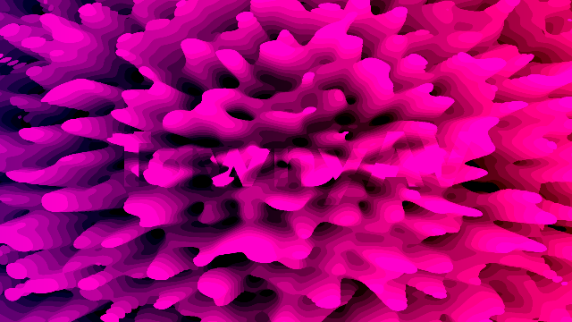
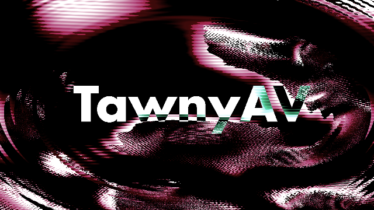
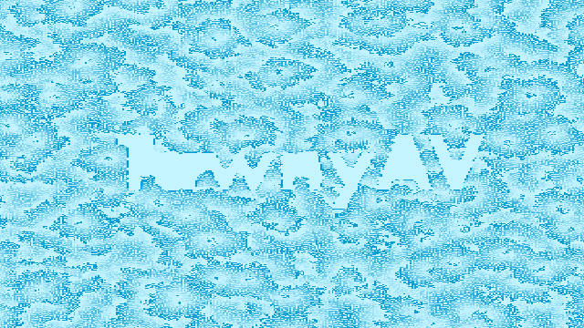

# Tawny AV

## Description
Tawny AV is an audio-visual software built in Rust that is designed to display dynamic visualizations based on live audio captured from a microphone. The visuals are managed by 'scenes', which are modular components that will render visual effects to the screen, such as the image shader scene, which uses GLSL fragment shaders to create procedural visualisation. The software is designed to be modular, allowing developers to easily add new scenes and shaders.

# Features
 - Real-time Audio Processing using the device’s microphone to detect beats and trigger events dynamically.
 - Detected beats are automatically aligned with visual effects for a responsive audiovisual experience.
 - Modular scene management allows for easy addition of new visualizations.
 - GLSL fragment shaders to generate real-time visuals with smooth performance using the GPU.
 - CPU based simulations are also supported, such as cellular automata.
 - Resources are dynamically loaded at runtime, allowing for easy modification of visuals.
 - Users can modify shaders, color palettes, cellular automata, and background images to create their own visuals.
 - All visual assets (images, colors, and shaders) are interchangeable and can be modified by the user
 - Users with GLSL knowledge can implement their own shader effects to expand on the visuals.

## Examples










## Usage Guide

### Basic Usage

Download the program from the releases section.
Run the main executable.
Basic settings (Beat detection, audio processing sensitivity, scene selection and image loading) can be modified using the GUI.
For live AV shows, you may want to modify these without showing the GUI, I recommend learning the following shortcuts to modify basic settings on the fly:

Keyboard Shortcuts:
- H - Toggle the UI
- F11 - Toggle fullscreen
- 1-9 and Left/Right Arrows - Switch between different visualizations
- Space - Toggle beat detection
- Up/Down Arrows - Adjust beat detection sensitivity

### Advanced Usage

#### Customising your visuals:
Custom backgroung image:
- To add your own logo/image to the visuals first ensure the image file is in the correct format:
- Image file formatting guide here (image must be 1920x1080, white on transparrent background, png).
- Ensure the image is somewhere where you are able to locate it relative to the programs location (I recommend inside the resources/images directory)
- In the GUI, modify the file path to point towards your images location
- Click 'reload scenes'. This will reload the scenes with your custom image applied.

Custom colour palette:
- Colour palletes for each shader are stored in each individual shader file. These colours can be modified to your liking, but for your reference, I have left a copy of the default colour palette in the shader in the resources/shaders/palette.txt file.

Custom shaders:
- Users can add their own custom shaders.
- Simply add a working fragment shader contained in a .glsl file to the resources/shaders directory.
- WARNINGL The shader must be a working fragment shader, if the shader does not compile, the program will not start.

#### Custom Parameters:
- Upon starting the program, TawnyAV will look for a [tawny-av-params.txt](tawny-av-params) parameters file.
- This file contains global parameters that are used throughout the program.
- Modifying the parameters in this file will modify the global parameters when the program starts. This can be useful for setting up a default configuration for TawnyAV (for example, the image file path of your logo).
- The parameters are as follows:
```
SCREEN_WIDTH=854.0
SCREEN_HEIGHT=480.0
RENDER_WIDTH=1920.0
RENDER_HEIGHT=1920.0
IS_FULLSCREEN=false
BEAT_DETECTION_ENABLED=true
SENSITIVITY=3.0
IMAGE_FILEPATH=resources/images/logo.png
```

## Developers

The source code for TawnyAV is open source and available for those who want to further develop there own visuals.
Tawny AV is designed to be modular, allowing users to implement their own scene types and other visual types.

### Installation
- If you havent got rust installed already, install rust by following the instructions at [rustup.rs](https://rustup.rs/)
- Clone the repository with `git clone https://github.com/LeonStansfield/tawnyAV.git`
- In order for tawny AV to run, you will need to create a resources directory in the root of the project. This directory will contain the following subdirectories and files:
     - shaders (contains .glsl shaders used by shader scenes)
     - images (contains .png images used thoughout the program)
     - cellular_automata (contains the .txt files used to configure cellular automata scenes)
     - tawny-av-params.txt (contains the parameters used by tawny AV)
- I have provieded an example resources.zip file in the repository. Unzip this directory to the root of the project to get started.
- Run the program with `cargo run --release`
- See documentation in `docs/docs.md`.

## Project Plan
- Scenes:
     - Create 10 visualisations in total

     - Shader scene
     - Cellular automata scene
     - Video scene
          - Simply plays a video file
          - Takes params: Video file

- Improved functionality of the UI:
    - Chose audio input device

- Proper scene description file (.tsd) for each scene.
     - Instead of tawnyAV dynamically createing a scene for each shader, maybe we could create a scene description file that is dynamically loaded on startup.
     - This would allow for multiple types of scenes (shader, image, cellular automata, etc) to be created by the user and loaded at runtime.

- Add support to play videos and apply shader effects to videos - video_shader_scene.rs?

## Known Bugs
 - When pressing f11 for fullscreen, the window goes fullscreen but always on the primary monitor. This should be on the monitor the window is currently on.
 - Fullscreen not functional on Linux